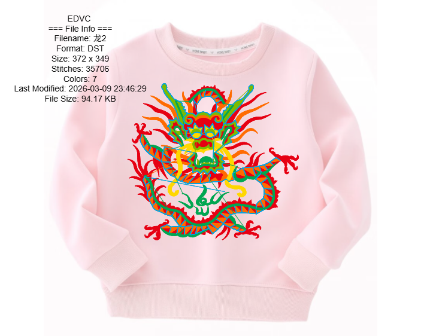

# EDVC - Embroidery Design Viewer and Converter

EDVC is a professional embroidery design viewing and conversion tool that supports viewing, editing, and converting multiple embroidery file formats.



## Features

- **Support for multiple embroidery file formats**: DST, PES, JEF, EXP, VP3, PEC, XXX, SEW, DSB, U01, TBF
- **Real-time preview and editing**: View embroidery designs in real-time with zoom, pan, and other operations
- **Format conversion**: Convert between different embroidery formats
- **Image export**: Export embroidery designs to image formats
- **Multi-language interface**: Support for Chinese, English, and Spanish languages
- **Background image support**: Support for adding background images (including SVG vector graphics)
- **Description text**: Add and manage description text
- **Stitch animation**: View embroidery stitch animation effects
- **Color management**: Support for custom thread colors

## Technology Stack

- **Frontend**: HTML5, CSS3, JavaScript
- **Backend**: Python, Flask
- **Image processing**: PIL (Python Imaging Library)
- **Internationalization**: Custom internationalization implementation

## Installation and Running

### Prerequisites

- Python 3.6 or higher
- pip package manager

### Install Dependencies

```bash
pip install flask pillow
```

### Run the Project

1. Run the `start.bat` script directly (Windows):

```bash
./start.bat
```

2. Or run manually:

```bash
python main.py
```

3. Visit http://localhost:6010 to open the application

## Usage Instructions

1. **Open File**: Click the "Open" button to select an embroidery file
2. **Add Background**: Click the "Add Background" button to add a background image (SVG supported)
3. **Export Image**: Click the "Export Image" button to export the design as an image
4. **Convert Format**: Click the "Convert Format" button to select the target format for conversion
5. **View Stitches**: View stitch list and animation in the left panel
6. **Add Description**: Add description text in the left panel
7. **Adjust Language**: Select interface language in the top right corner

## Project Structure

```
EDVC_Deploy-V0.5/
├── static/                # Static resources
│   ├── css/              # CSS styles
│   │   └── style.css     # Main style file
│   ├── data/             # Data files
│   │   ├── contact_info.json  # Contact information
│   │   └── thread_colors.json # Thread color data
│   └── js/               # JavaScript files
│       └── app.js        # Main application logic
├── templates/            # HTML templates
│   ├── index.html        # Main page
│   ├── T恤.svg           # Example SVG file
│   └── ic_帽子.svg        # Example SVG file
├── main.py               # Main application file
├── start.bat             # Startup script
├── test_screenshot.py    # Test script
├── edvc_screenshot.png   # Application screenshot
└── README.md             # Project documentation
```

## Core Function Modules

### 1. File Processing
- Support for reading multiple embroidery file formats
- File information parsing and display
- Format conversion functionality

### 2. Canvas Operations
- Real-time embroidery design preview
- Zoom and pan functionality
- Background image management
- Stitch animation playback

### 3. Internationalization Support
- Multi-language interface switching
- Translation dictionary management
- Dynamic text updates

### 4. Data Management
- Description text management
- Stitch data processing
- Background image storage

## Contribution Guidelines

1. Fork this repository
2. Create a feature branch (`git checkout -b feature/AmazingFeature`)
3. Commit your changes (`git commit -m 'Add some AmazingFeature'`)
4. Push to the branch (`git push origin feature/AmazingFeature`)
5. Open a Pull Request

## License

This project is licensed under the MIT License - see the [LICENSE](LICENSE) file for details

## Contact Us

- **Email**: support@edvc.com
- **Phone**: +86 123 4567 8910
- **Website**: www.edvc.com

---

© 2026 EDVC Team. All rights reserved.